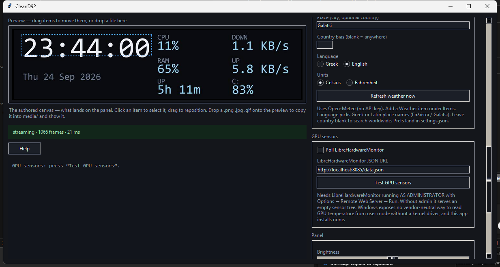

# CleanD92

A driver-free control app for the **StreamDock D92** — the 1920×464 USB
monitoring panel sold as MiraBox D92 and under a few other names. Its
firmware identifies itself as `HOTSPOTEKUSB HID DEMO`, USB ID `5548:1011`.

CleanD92 talks to the panel over its own HID protocol and **installs nothing
on your system**: no driver, no service, no administrator rights.



## Why this exists

The panel ships with a utility that works by creating a **virtual display**
through a kernel-mode display driver, capturing that display, and forwarding
the frames to the panel over USB.

On my machine that arrangement did not survive Windows' power management. The
PC began bugchecking with `0x9F DRIVER_POWER_STATE_FAILURE`: a hang a few
seconds after the login PIN, then a reboot, every few minutes. Safe Mode was
fine, nothing in the logs named the panel, and the usual driver cleanup tools
do not touch it because they only handle AMD, NVIDIA and Intel packages.
Removing the virtual display driver ended it.

None of that machinery is actually necessary. The panel is a plain USB HID
device: Windows binds its own built-in HID driver to it, and any program can
open that interface and push JPEG frames. CleanD92 does the same job entirely
from user mode and leaves nothing behind.

If your PC is rebooting in a loop, see
[Removing the bundled driver](#removing-the-bundled-driver).

## Features

- **Info screen** — clock, date, CPU load and temperature, RAM as a percentage
  or in gigabytes, per-drive disk usage and temperature, network up/down
  speed, uptime, and GPU load and temperature for every card.
- **Weather** — current conditions and a multi-day forecast from Open-Meteo
  (no API key). Sunrise and sunset sit under the current block; at night the
  clear-sky icon follows the real moon phase.
- **World clocks** — another city's local time and offset from yours.
- **Image / GIF** — a single still or animated file.
- **Slideshow** — every file in the `media` folder in turn, with a dwell time
  and optional shuffle. Animated GIFs keep animating during their slot.
- **Layout editor** — drag readouts around on a live preview and set each
  one's size, alignment and colours. Readouts can be overlaid on top of an
  image or a slideshow.
- **Presets** — built-ins plus your own. **Save as…** stores a full scene
  (layout items, mode, quality, interval, weather, orientation, …). `hold`
  and the fixed canvas size are not saved; weather also lands in
  `settings.json` for the next cold start.
- **Hold and Apply** — keep editing while the panel goes on showing the frame
  it already has, then push one frame when you are happy with it.
- **Minimise to tray** — the minimise button hides the window in the
  notification area; the panel keeps updating. Double-click the tray icon to
  restore. Closing the window still quits.
- **Horizontal or vertical** content, with a 180° flip.

## Install

### The easy way: the released exe

1. Open [Releases](https://github.com/nmx88/CleanD92/releases) and download
   **`CleanD92.exe`**.
2. Put it in a folder of its own — `C:\Tools\CleanD92`, or anywhere you
   like. It creates two folders beside itself on first run.
3. Plug in the panel and double-click the exe.

**Nothing needs installing.** No Python, no runtime, no driver, no
administrator rights. Windows 10 or 11, 64-bit, is the only requirement.

Windows may show a *"Windows protected your PC"* SmartScreen warning, because
the exe is not code-signed. Click **More info → Run anyway** if you are happy
to. If you would rather not trust a stranger's binary, run from source
instead — it is four Python files and you can read all of them.

On first run you get:

```
CleanD92.exe
media/        put your .png .jpg .gif .bmp .webp files here
presets/      saved scenes (layout + settings), as .json
settings.json last weather place / language / units (app restart default)
```

The panel opens on the **Info** screen (clock and system readouts) even with
an empty `media/` folder. If the device is missing or held by the official
MiraBox software, a **No panel found** window lists the usual causes and
offers Retry. Pick **Vertical** under Orientation if the panel is mounted on
its end — the matching tall preset loads automatically when you are still on
a built-in layout.

### From source

You need **Python 3.10 or newer** for Windows, from
[python.org](https://www.python.org/downloads/windows/). During installation,
tick **"Add python.exe to PATH"**.

```
git clone https://github.com/nmx88/CleanD92.git
cd CleanD92
pip install -r requirements.txt
python d92_app.py
```

That pulls in `hidapi` for USB HID access, `pillow` for image work,
`psutil` for the system readouts, `pystray` for minimise-to-tray, plus
`windnd` and `tzdata` on Windows. The window itself uses tkinter, which
ships with Python.

Other ways to run it:

```
python d92_app.py              the window (default)
python d92_app.py --web        window plus a browser UI on port 8092
python d92_app.py --web-only   headless, browser UI only
python d92.py probe            open the panel and print its identity
python d92.py bars             stream colour bars, to check orientation
```

With `--web`, the control page listens on **all interfaces** (`0.0.0.0:8092`)
so a phone on the same Wi-Fi can open it. The window shows a **Phone UI**
address under Panel (Copy phone URL). Use only on your LAN — there is no
login; do not port-forward 8092 to the internet. On this PC you can still
use `http://127.0.0.1:8092`.

## Everyday use

1. **Info screen** — leave Mode on Clock. Drag items on the preview; colours
   and sizes are on the right under Items.
2. **Media** — drop files onto the preview or into `media/`, then pick Image /
   GIF or Slideshow. Ultrawide / 32:9 sources crop cleanly.
3. **Weather** — add a Weather item; set Place and language under Weather.
   Horizon is Now or 1–7 days. Optional Place override on the item for a
   second city (Now / 1 day only).
4. **Save a scene** — **Save as…** under Layout. Next time, pick it from the
   preset list to restore layout **and** mode / quality / interval / weather.
   Built-ins (Wide dashboard, …) are layout-only.
5. **Hold** — tick Hold while you edit; the panel stays on its last frame.
   **Apply now** pushes one fresh frame. Hold itself is never saved in a
   preset.
6. **Phone** — run with `--web` (or the exe equivalent if you launch that way
   from a shortcut). Open the **Phone UI** URL shown under Panel on a phone
   on the same Wi-Fi.

See **Presets (scenes)** below for exactly what is stored where.

## Presets (scenes)

**Save as…** writes a JSON file under `presets/`. User presets are full
**scenes**, not layout-only:

| Stored in the preset | Not stored |
|---|---|
| Layout items (clock, weather, readouts, …) | `hold` (draft toggle while editing) |
| Mode (clock / image / slideshow) and selected media file name | Fixed canvas size (always 1920×462 authoring) |
| Brightness, interval, JPEG quality, info background | Built-in presets (Wide / Tall …) — those ship items only |
| Orientation, flip, fit, slide dwell / shuffle | |
| Weather place, country, units, language | |
| Poll LHM + LHM URL | |

Loading a user preset restores that whole scene. Older preset files that only
have `items` still load; they leave mode / quality / weather as they are.

**`settings.json`** is separate: it remembers the last weather place / language
/ units across app restarts so a cold start has a city before you pick a
preset. Editing weather updates both the live state and `settings.json`;
saving a preset also snapshots those weather fields into that preset.

### Building the exe yourself

```
pip install -r requirements-build.txt
pyinstaller --noconfirm --clean CleanD92.spec
```

The result is `dist\CleanD92.exe`, one file of roughly 25–45 MB.

## Before first use

**Close the bundled utility if it is running.** It holds the USB device open,
and CleanD92 cannot reach the panel while it does. If the app says it cannot
open the device, check that first.

## Removing the bundled driver

Only relevant if you installed the vendor utility.

1. **Settings → Apps → Installed apps** → uninstall the utility. Do this
   **first**: removing the driver while the utility is still installed just
   gets it reinstalled at the next login.
2. In an **administrator** Command Prompt, find the driver package:

   ```
   pnputil /enum-drivers /class Display
   ```

   Look for `Original Name: miraboxvdd.inf` and note its `Published Name`,
   something like `oem164.inf`.
3. Remove it:

   ```
   pnputil /delete-driver oem164.inf /uninstall
   ```

   `Driver package uninstalled.` means it worked. A following
   `not an installed OEM INF` line is normal — the package was already gone by
   the time the second stage ran.
4. Windows Update may hand the driver straight back. To prevent that:

   ```
   reg add "HKLM\SOFTWARE\Policies\Microsoft\Windows\WindowsUpdate" /v ExcludeWUDriversInQualityUpdate /t REG_DWORD /d 1 /f
   ```

   That blocks **all** drivers from Windows Update, which is blunt but
   effective; `reg delete` on the same value undoes it. Microsoft's
   `wushowhide.diagcab` is the precise alternative — it hides named updates
   only.
5. Check nothing is left:

   ```
   pnputil /enum-drivers /class Display
   ```

   Only your real graphics drivers should be listed.

If you had the reboot loop, `powercfg /h off` plus disabling PCI Express link
state power management removes the other common trigger for `0x9F` on these
machines.

## Temperatures and GPU readings

CPU load, RAM, disk usage, network speed and uptime work out of the box.

**Temperatures** — CPU, GPU and disk — and **GPU load** need
[LibreHardwareMonitor](https://github.com/LibreHardwareMonitor/LibreHardwareMonitor)
running alongside. Windows exposes no vendor-neutral way to read any of them
from user mode without a kernel driver, and installing one would defeat the
point of this project. LibreHardwareMonitor is a separate, well-established
open-source tool; whether to run it is your decision rather than something
this app makes for you.

1. Download LibreHardwareMonitor and **run it as administrator**. Without
   elevation it starts but reports an empty sensor tree.
2. **Options → Remote Web Server → Run.**
3. In CleanD92, tick **Poll LibreHardwareMonitor**, then press
   **Test GPU sensors**.

The test button lists every sensor source it found and every piece of hardware
LibreHardwareMonitor reports, which makes a mismatch easy to spot. Each GPU
appears separately, so a machine with a discrete card and an integrated one
gets a readout for both. Matching prefers **CPU Package** (or AMD Tctl),
**GPU Core** temperature (hot spot only as fallback), and each drive's
composite or plain temperature under a short model label. Some integrated
GPUs expose load in LHM but no temperature leaves — those show load only.

| Message | Meaning |
|---|---|
| `No connection could be made … actively refused it` (WinError 10061) | Nothing is listening on that port — LibreHardwareMonitor is not running, or its web server is off. |
| `timed out` | Something is listening but not answering. Try `127.0.0.1` instead of `localhost`, or a different port. |
| `connected, but no usable sensors in the tree` | LibreHardwareMonitor is not elevated, or monitoring is switched off in its settings. |

## Getting media that looks good on it

The panel is an extreme strip: **1920 × 462, about 4.16:1**. Almost nothing
you already have is that shape, and the mismatch is what makes most clips
look bad rather than anything about the panel itself.

### What to look for

Search for **ultrawide**, **32:9**, **dual monitor** or **banner** wallpapers
and loops. Material made for those shapes crops down to the panel with room
to spare and stays sharp, because you are scaling **down** rather than up.

| Source shape | Common name | Crop needed | Result |
|---|---|---|---|
| 3840 × 1080 | 32:9, dual monitor | keeps 86% of the height, scales 0.50× | excellent, still sharp |
| 5120 × 1440 | super ultrawide | keeps 86%, scales 0.375× | excellent |
| 3440 × 1440 | 21:9 ultrawide | keeps 57%, scales 0.56× | good |
| 1920 × 1080 | ordinary 16:9 | keeps 43%, no scaling | usable, plan the framing |
| 1080 × 1920 | phone wallpaper | keeps 14%, scales 1.8× up | poor — a thin band of the picture |
| small phone GIF, e.g. 270 × 480 | social-media loop | keeps 14%, scales 7× up | unusable |

Free, no-attribution-needed loops and stills: **Pixabay** and **Pexels**.
Filter by orientation and sort by resolution; anything 3840 wide or more is a
good candidate.

Portrait sources are the ones to avoid. Cropping a 0.56:1 picture to 4.16:1
leaves a band about one seventh of its height — usually a strip of background
with the subject cut away — and if the source is small as well, that band then
has to be enlarged several times over. The two workarounds both cost
something: centring the whole picture with blurred bars stays sharp but fills
only about 14% of the strip, and tiling it across fills the panel but reads as
obvious wallpaper repetition with the subject chopped at every seam.

### Fit

**Cover (crop)** fills the strip and cuts off whatever does not fit — right
for landscapes, water, abstract textures. **Letterbox** shows the whole frame
with black bars — right when the subject would otherwise be cut in half.

### Preparing your own with ffmpeg

The panel only ever receives JPEG, so video has to become an animated GIF
first. One command does the whole job — scale, crop and a decent palette:

```
ffmpeg -i clip.mp4 -vf "fps=12,scale=1920:462:force_original_aspect_ratio=increase,crop=1920:462,split[a][b];[a]palettegen=max_colors=128[p];[b][p]paletteuse=dither=bayer" -loop 0 panel.gif
```

- `fps=12` — the panel shows roughly 3 frames a second at the default 350 ms
  interval, so anything above 12 is wasted file size.
- `force_original_aspect_ratio=increase` then `crop` is the "cover" fit. For
  letterbox, use `decrease` and add `,pad=1920:462:-1:-1:black`.
- Keep the clip **under about 12 seconds**. Longer animations are subsampled
  to 150 frames when loaded, so the extra frames cost download size and give
  nothing back.

Trim a longer video first with `-ss 00:00:05 -t 10` before the `-i`.

### Sizes and smoothness

Frames are re-encoded internally, so a large GIF costs memory only while it
loads — but it still has to live in your `media` folder. A 1920 × 462 loop of
90 frames lands around 30 MB; 128 colours instead of 256 roughly halves that
with very little visible difference on this panel.

If a GIF looks jerky, lower **Interval (ms)** towards 150–200. That genuinely
helps, at the cost of a higher chance of the random USB dropouts described
below. 350 ms is the value known to be safe; everything under it is a
trade you make knowingly.

### A note on other people's work

Plenty of the nicest loops are signed by whoever drew them. Please leave the
signature where it is — it is usually the only way anyone can find the artist.
If a watermark bothers you, the free-licence sources above have material with
none.

## Known limitations of the panel

Properties of the hardware, not bugs in this app.

- **Random USB dropouts.** The panel can stop accepting writes anywhere from a
  few seconds to a few minutes into a session. Nobody has root-caused it.
  Recovery needs a physical unplug and replug; CleanD92 reports it plainly
  rather than hiding it behind retries.
- **The handle must not be reopened.** Reopening the HID handle within one
  physical connection reliably leaves the panel black until it is replugged.
  There is deliberately no reopen path in the code.
- **The stream must never go idle.** A frame is pushed every interval whether
  anything changed or not. If the pushes stop, the panel goes dark.
- **The frame shape is fixed.** The frame header carries no dimensions, so the
  panel infers geometry from the JPEG and accepts only its own portrait shape.
  Anything else makes it tile the image and stop accepting writes, so the app
  refuses to send a frame of the wrong shape.
- **350 ms between frames** is the cadence known to be safe. Lower is smoother
  for GIFs and raises the dropout rate; the interval is adjustable.
- **No video.** The panel only ever receives JPEG — the vendor's MP4 support is
  host-side decoding. Adding it here would mean bundling an ffmpeg binary and
  roughly doubling the download, so it is left out.

## Adding another device

CleanD92 drives one model today, but most of it is not about that model.

**Already model-agnostic:** the layout engine (`d92_layout.py`) knows nothing
about USB — items are positioned as fractions of a canvas, so any panel shape
works. The render loop, the media cache, the sensors and the editor all talk
to "a canvas W×H". So do the two operating rules — never reopen the handle,
never let the stream go idle — because those come from the firmware family
rather than from this particular panel.

**Specific to the D92:** every literal in the `DEVICE` profile at the top of
`d92.py` — the `CRT\0\0` magic, the `DRA` frame verb, the header layout, the
`DIS` and `LIG` control verbs and where their arguments sit, the canvas size
and rotation, and the frame interval.

USB vendor id `0x5548` covers several StreamDock and Ajazz products —
`1008`, `1002`, `6670`, `6672` all appear in the wild alongside the D92's
`1011` — and they share the vendor-defined HID usage page `0xFFA0`. That
makes the general shape likely to be the same. It does not make the bytes the
same, and the key-equipped models additionally send input reports for button
presses, which this app has no path for at all.

So porting is realistic, but it needs someone holding the device:

1. Capture the vendor utility's traffic with **Wireshark + USBPcap**, on a
   machine other than the one you care about. Push a few known images —
   black, white, a flat colour, a photograph — and compare the streams.
2. Look for `FF D8 FF` at the start of a payload (JPEG), for constant bytes
   before the data (the header), and for a size difference between a flat
   colour and a photograph (compression).
3. Copy the `DEVICE` dict, fill in what you found, and try it.

I have not built a plugin interface for this, on purpose. An abstraction
designed with one device on the bench almost always puts its seams in the
wrong places; the second model is what shows you where they belong. If you
have another panel in this family and get it talking, open an issue with your
`DEVICE` profile and I will restructure around both rather than guess now.

**One warning.** Do not point the D92's bytes at a different product id to see
what happens. A wrong-shaped frame already makes this panel tile the image and
stop accepting writes until it is replugged, and firmware in this family
carries update verbs as well — a stray vendor report can leave a device in a
state that a replug does not fix.

## How it works

```
d92.py          the device: HID transport, wake sequence, JPEG frame push
d92_layout.py   the layout model: items, presets, rendering, hit testing
d92_panel.py    the render loop, media cache, sensors, and the browser UI
d92_app.py      the native window and layout editor
```

One process owns the device. The HID handle is opened once at startup and held
until exit, and a single render thread performs every write; both front ends
only edit shared state. File loading and sensor polling run on their own
threads, because a render thread that pauses is a panel that goes dark.

Frames are cached JPEG-compressed rather than as raw bitmaps: a 1920×462 frame
is 2.66 MB decoded and about 60 KB encoded, so a long animation no longer
exhausts memory.

## Credits

The panel's wire protocol was reverse-engineered by
[chainsaid/U-Sidecar](https://github.com/chainsaid/U-Sidecar), whose published
notes established the parts that cannot be guessed: the `CRT\0\0` + `DRA`
frame header, the `DIS` and `LIG` control verbs, the 1024-byte chunking, the
fact that `WriteFile` works where `HidD_SetOutputReport` does not, the
`DIS → ~450 ms → LIG` connect sequence that also revives a blacked-out panel,
and the two operating rules above about reopening the handle and letting the
stream go idle. Thank you for publishing it.

Everything in this repository — the Python implementation, the layout and
preset system, the editor, the media pipeline, the sensor integration and the
packaging — is my own work. U-Sidecar is a C# application built on a virtual
display driver; CleanD92 deliberately uses none.

## Licence

MIT — see [LICENSE](LICENSE).
